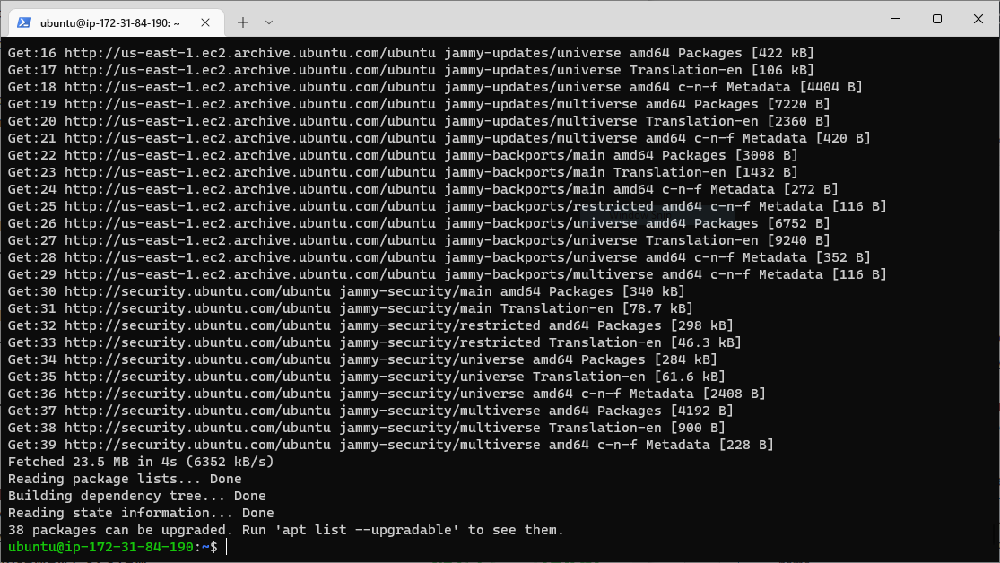
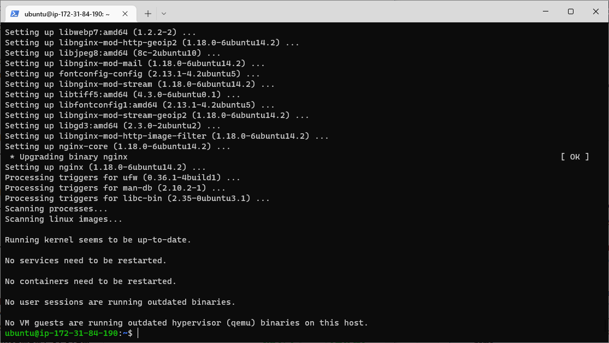
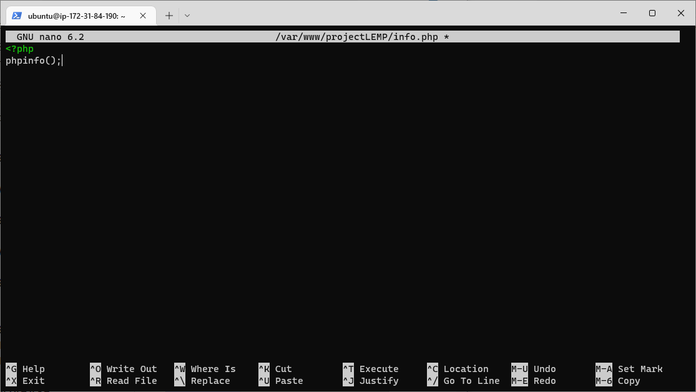

# Project 2

## LEMP STACK IMPLEMENTATION

### STEP 1 – INSTALLING THE NGINX WEB SERVER

- update your server’s package index

run:

`sudo apt update`



- install Nginx

run:

`sudo apt install nginx`


hit 'y' to continue



To verify that nginx was successfully installed and is running as a service in Ubuntu, run:


`sudo systemctl status nginx`


 It is green and running, hence we did everything correctly.

 We have TCP port 22 open by default on our EC2 machine to access it via SSH, so we need to add a rule to EC2 configuration to open inbound connection through port 80:


Our server is running and we can access it locally and from the Internet (Source 0.0.0.0/0 means ‘from any IP address’).

 let us try to check how we can access it locally in our Ubuntu shell, run:

 `curl http://localhost:80`

 

 Now it is time for us to test if our Nginx server can respond to requests from the Internet.
Opened a web browser  and try to access following url:

http://18.206.56.169:80


Our Nginx server was successfully installed and working.

### STEP 2 — INSTALLING MYSQL

MySQL is a popular relational database management system used within PHP environments, so we will use it in our project.

Again, use ‘apt’ to acquire and install this software:

` sudo apt install mysql-server`


When prompted, confirm installation by typing Y, and then ENTER.


When the installation is finished, log in to the MySQL console by typing:

`sudo mysql`


 Before running the script you will set a password for the root user, using mysql_native_password as default authentication method. We’re defining this user’s password as PassWord.1.


 `ALTER USER 'root'@'localhost' IDENTIFIED WITH mysql_native_password BY 'PassWord.1';`

 

 Exit the MySQL shell with:

 `mysql> exit`

 


 Start the interactive script by running:

 ` sudo mysql_secure_installation`

 This will ask if you want to configure the VALIDATE PASSWORD PLUGIN.

 


 Note: Enabling this feature is something of a judgment call. Answer Y for yes, or anything else to continue without enabling.


 

 When you’re finished, test if you’re able to log in to the MySQL console by typing:

 `sudo mysql -p`


 Notice the -p flag in this command, which will prompt you for the password used after changing the root user password.

 

 To exit the MySQL console, type:

 `mysql> exit`

 

MySQL server is now installed and secured. Next, we will install PHP, the final component in the LEMP stack.


### STEP 3 – INSTALLING PHP


We have Nginx installed to serve our content and MySQL installed to store and manage our data. Now we can install PHP to process code and generate dynamic content for the web server.

 We’ll need to install 'php-fpm', which stands for “PHP fastCGI process manager”, and tell Nginx to pass PHP requests to this software for processing. Additionally, we’ll need 'php-mysql', a PHP module that allows PHP to communicate with MySQL-based databases.

 `sudo apt install php-fpm php-mysql`

When prompted, type Y and press ENTER to confirm installation.

 

 We now have  PHP components installed. Next, we will configure Nginx to use them.

 ### STEP 4 — CONFIGURING NGINX TO USE PHP PROCESSOR

  In this project, we will use 'projectLEMP' as an example domain name.

  Create the root web directory for your_domain as follows:

  `sudo mkdir /var/www/projectLEMP`


Next, assign ownership of the directory with the $USER environment variable, which will reference your current system user:

`sudo chown -R $USER:$USER /var/www/projectLEMP`


Then, open a new configuration file in Nginx’s sites-available directory using your preferred command-line editor. Here, we’ll use nano:

`sudo nano /etc/nginx/sites-available/projectLEMP`


 Paste in the following bare-bones configuration:

 ```
 #/etc/nginx/sites-available/projectLEMP

server {
    listen 80;
    server_name projectLEMP www.projectLEMP;
    root /var/www/projectLEMP;

    index index.html index.htm index.php;

    location / {
        try_files $uri $uri/ =404;
    }

    location ~ \.php$ {
        include snippets/fastcgi-php.conf;
        fastcgi_pass unix:/var/run/php/php8.1-fpm.sock;
     }

    location ~ /\.ht {
        deny all;
    }

}
```


To save and close the file, type CTRL+X and then y and ENTER to confirm.

Activate the configuration by linking to the config file from Nginx’s sites-enabled directory:

`sudo ln -s /etc/nginx/sites-available/projectLEMP /etc/nginx/sites-enabled/`


This will tell Nginx to use the configuration next time it is reloaded. You can test your configuration for syntax errors by typing:

`sudo nginx -t`


We also need to disable default Nginx host that is currently configured to listen on port 80, for this run:


`sudo unlink /etc/nginx/sites-enabled/default`


Reload Nginx to apply the changes:

`sudo systemctl reload nginx`


The new website is now active, but the web root /var/www/projectLEMP is still empty. Create an index.html file in that location so that we can test that the new server block works as expected.

run:


`sudo echo 'Hello LEMP from hostname' $(curl -s http://169.254.169.254/latest/meta-data/public-hostname) 'with public IP' $(curl -s http://169.254.169.254/latest/meta-data/public-ipv4) > /var/www/projectLEMP/index.html
`


Now we go to our browser and try to open the website URL using IP address:

http://44.204.175.134:80


The LEMP stack is now fully configured. In the next step, we’ll create a PHP script to test that Nginx is in fact able to handle .php files within the newly configured website.

### STEP 5 – TESTING PHP WITH NGINX

At this point, our LEMP stack is completely installed and fully operational.


You can test it to validate that Nginx can correctly hand .php files off to your PHP processor.

You can do this by creating a test PHP file in your document root. Open a new file called 'info.php' within your document root in your text editor:

`sudo nano /var/www/projectLEMP/info.php`


Type or paste the following lines into the new file. This is valid PHP code that will return information about your server:

`<?php
phpinfo();`



We can now access this page in your web browser by visiting the domain name or public IP address you’ve set up in your Nginx configuration file, followed by /info.php:


http://`server_domain_or_IP`/info.php


You will see a web page containing detailed information about your server:


After checking the relevant information about your PHP server through that page, it’s best to remove the file you created as it contains sensitive information about your PHP environment and your Ubuntu server. You can use rm to remove that file:

`sudo rm /var/www/your_domain/info.php`


And now we are back to the '404 not found' page.


With this our Nginx server and PHP processor are communicating well.


### STEP 6 – RETRIEVING DATA FROM MYSQL DATABASE WITH PHP


In this step hope create a test database (DB) with simple "To do list" and configure access to it, so the Nginx website would be able to query data from the DB and display it.


We will create a database named example_database and a user named example_user.


First, connect to the MySQL console using the root account:

`sudo mysql -p`


Input password at the 'Enter password' prompt to gain access.


To create a new database, run the following command from the MySQL console:

```
mysql> CREATE DATABASE `example_database`;
```


Now you can create a new user and grant him full privileges on the database you have just created.

The following command creates a new user named example_user, using mysql_native_password as default authentication method. We’re defining this user’s password as password, but you should replace this value with a secure password of your own choosing.

run:

`mysql>  CREATE USER 'example_user'@'%' IDENTIFIED WITH mysql_native_password BY 'password';`


Now we need to give this user permission over the example_database database.

run:

`mysql> GRANT ALL ON example_database.* TO 'example_user'@'%';`


This will give the example_user user full privileges over the example_database database, while preventing this user from creating or modifying other databases on your server.

Now exit the MySQL shell with:

`mysql> exit`


You can test if the new user has the proper permissions by logging in to the MySQL console again, this time using the custom user credentials:

`mysql -u example_user -p`

Notice the -p flag in this command, which will prompt you for the password used when creating the example_user user.


 After logging in to the MySQL console, confirm that you have access to the example_database database:


`mysql> SHOW DATABASES;`

This will give the following output:


Next, we’ll create a test table named todo_list. From the MySQL console, run the following statement:

```
CREATE TABLE example_database.todo_list (
     item_id INT AUTO_INCREMENT,
     content VARCHAR(255),
     PRIMARY KEY(item_id)
 );
```


Insert a few rows of content in the test table. You might want to repeat the next command a few times, using different VALUES:

`mysql> INSERT INTO example_database.todo_list (content) VALUES ("My first important item");`


To confirm that the data was successfully saved to the table, run:

`mysql>  SELECT * FROM example_database.todo_list;`

Output:


After confirming that we have valid data in the test table, we can exit the MySQL console:

`mysql> exit`


Now we can create a PHP script that will connect to MySQL and query for our content. Create a new PHP file in your custom web root directory using your preferred editor. 

run:

`nano /var/www/projectLEMP/todo_list.php`


The following PHP script connects to the MySQL database and queries for the content of the todo_list table, displays the results in a list. If there is a problem with the database connection, it will throw an exception.

Copy this content into your 'todo_list.php' script:

```
<?php
$user = "example_user";
$password = "password";
$database = "example_database";
$table = "todo_list";

try {
  $db = new PDO("mysql:host=localhost;dbname=$database", $user, $password);
  echo "<h2>TODO</h2><ol>";
  foreach($db->query("SELECT content FROM $table") as $row) {
    echo "<li>" . $row['content'] . "</li>";
  }
  echo "</ol>";
} catch (PDOException $e) {
    print "Error!: " . $e->getMessage() . "<br/>";
    die();
}
```


Save and close the file after editing.

We can now access this page in the web browser by visiting the domain name or public IP address configured for the website, followed by /todo_list.php:

http://<Public_domain_or_IP>/todo_list.php

We see a page, showing the content we’ve inserted in the test table:


This means our PHP environment is ready to connect and interact with our MySQL server.  With this we have come to the end of this project.


